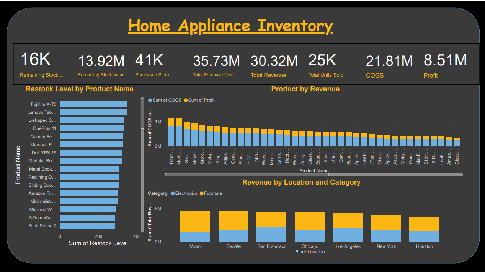
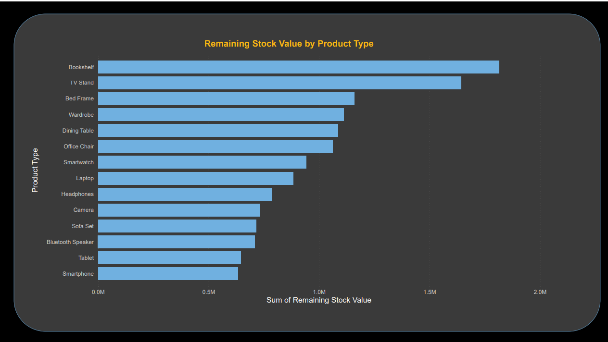
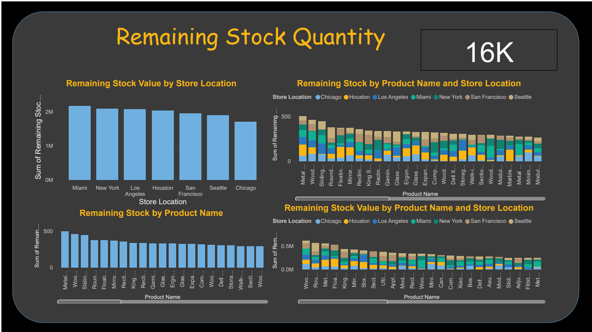
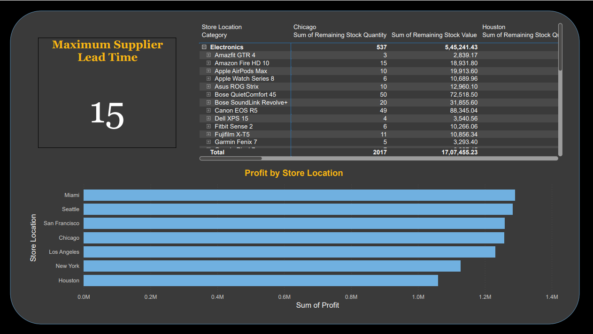

# Home Appliance Inventory Dashboard

An interactive Power BI dashboard that analyses inventory, sales and profit across 7 store locations for electronics and furniture products. It helps track remaining stock, spot products that need restocking, and compare store performance.

## Dashboard Preview

**Page 1: Overview (KPIs, restock levels, revenue and profit)**

**Page 2: Remaining stock value by product type**

**Page 3: Remaining stock by store and product**

**Page 4: Supplier lead time, stock table and profit by store**

## Video Walkthrough
[Watch the walkthrough on LinkedIn](https://lnkd.in/p/dn3c8HkB)

## What the Dashboard Shows
- **Key metrics at a glance:** remaining stock (16K units, 13.92M value), purchased stock (41K units, 35.73M cost), total revenue (30.32M), units sold (25K), COGS (21.81M) and profit (8.51M).
- **Restocking and stock levels:** restock level by product, remaining stock by product and store location, and remaining stock value by product type (Bookshelf and TV Stand hold the highest value).
- **Store performance:** revenue by location and category (electronics vs furniture), and profit by store, where Miami and Seattle lead and Houston is lowest.
- **Supplier and detail view:** maximum supplier lead time (15) and a drill-down table of remaining stock quantity and value by category, product and store.

## Tools Used
- Power BI (dashboard and visuals)
- Excel (dataset)

## Files
- `Home Appliances.pbix`: the Power BI dashboard file
- `Home Appliance Inventory.xlsx`: the dataset used

## How to Open
Download the `.pbix` file and open it with Power BI Desktop (free).

## Author
Asapriya V B | [LinkedIn](https://linkedin.com/in/asapriyavb)
